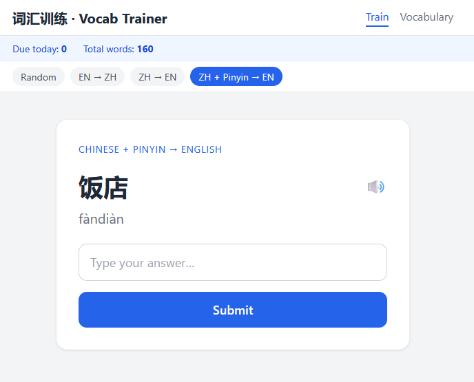
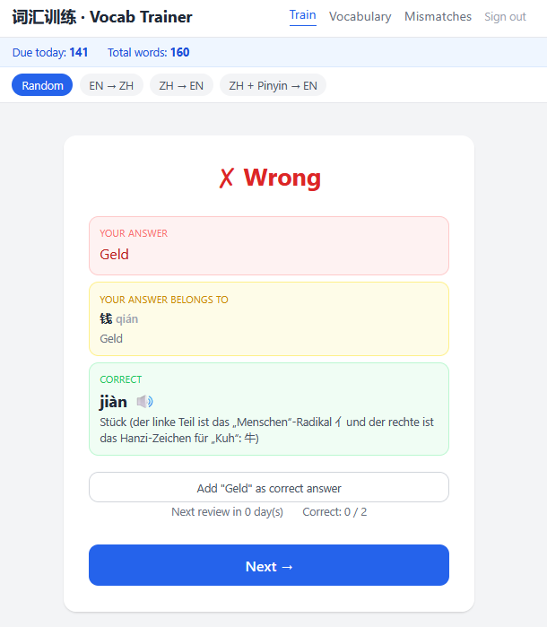
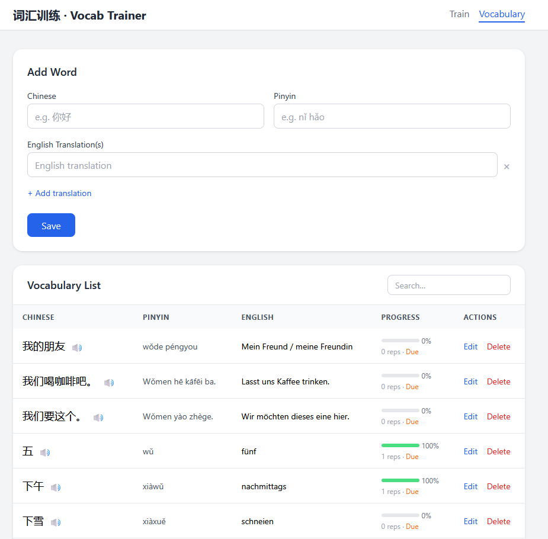
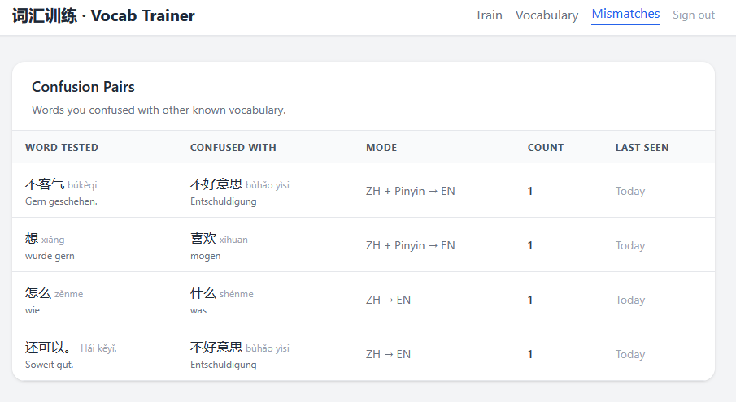

# 词汇训练 · Vocabulary Trainer

A self-hosted Chinese–English vocabulary trainer with spaced repetition (SM-2).

## Features

- Add vocabulary with Chinese characters, pinyin, and one or more English translations
- N:N word relationships — the same English or Chinese word can be shared across entries
- Three quiz modes chosen at random or fixed by user: English → Chinese, Chinese → English, Chinese + Pinyin → English
- [SM-2 spaced repetition](https://www.supermemo.com/en/blog/application-of-a-computer-to-improve-the-results-obtained-in-working-with-the-super-memo-method) — words you get wrong appear more often; correct answers are scheduled further into the future
- Flexible answer matching: parenthesised segments are optional (`(das) Essen` accepts `Essen`); slash-separated alternatives are each valid (`Essen / Gericht` accepts `Essen` or `Gericht`)
- On a wrong answer: see what you typed alongside the correct Chinese + pinyin + translations, and optionally add your answer as an accepted translation with one click
- **Confusion tracking** — if your wrong answer is a valid translation of a *different* known word, it is recorded as a confusion pair (works in all quiz modes); a yellow hint box shows immediately on the result screen, and the full history is visible on the `/mismatches` page
- 🔊 Read-aloud button on every Chinese word — plays a cached MP3 (Microsoft Edge neural TTS, built into the binary), falls back silently to the browser's Web Speech API
- **Tags** — assign tags to vocabulary words (e.g. "HSK1", "food", "travel"); filter by tag on both the vocabulary list and training page (OR logic when multiple tags selected); tags are created on-the-fly via an autocomplete input and cleaned up automatically when no longer used
- Vocabulary management: add, edit, delete, search, paginate, sort by any column; SM-2 progress shown per word
- Due-date and correct-answer scheduling include a small random jitter to shuffle cards and avoid repetitive review patterns
- Bulk import from a structured text file (see `cmd/import`)
- Optional single-user password protection (set `AUTH_USER` / `AUTH_PASSWORD` in `.env`)
- SQLite database stored on the host filesystem
- Runs in Docker or natively; static frontend is embedded in the Go binary — no Python or external tools required
- Deploy to Raspberry Pi with `make release` (cross-compiles for `linux/arm64`, rsyncs via SSH)

## Screenshots

Training — question


Training — answer


Vocabulary management |


Overview - Vocabulary Mismatches


## Quick start

**Requirements:** Docker and Docker Compose.

```bash
git clone <repo-url>
cd vocabulary_trainer
make run
```

Then open [http://localhost:8080](http://localhost:8080).

1. Go to **Vocabulary** (`/vocab`) and add some words.
2. Return to **Train** (`/`) to start a quiz session.
3. Check **Mismatches** (`/mismatches`) to review words you've confused with each other.

The SQLite database is stored in `./data/vocab.db` on your host.

## Authentication

Authentication is disabled by default. To enable it, set `AUTH_USER` and `AUTH_PASSWORD` in your `.env` file:

```bash
AUTH_USER=admin
AUTH_PASSWORD=yourpassword
```

When enabled, all pages and API endpoints require a valid session. Unauthenticated page requests are redirected to `/login`; unauthenticated API requests receive `401 Unauthorized`. Sessions expire after 24 hours. The session secret is generated randomly at startup, so all sessions are invalidated when the server restarts.

## Makefile targets

| Target | Description |
|---|---|
| `make build` | Build the Docker image |
| `make run` | Start the app in the background |
| `make stop` | Stop the running container |
| `make logs` | Tail container logs |
| `make dev` | Run locally without Docker (requires Go 1.24+) |
| `make tidy` | Tidy Go module dependencies |
| `make import` | Import vocabulary from a text file (see below) |
| `make release` | Cross-compile for Raspberry Pi and rsync to `RSYNC_DEST` |
| `make test` | Run all Go and JS tests |
| `make clean` | Stop containers and remove build artifacts |

## Bulk import

Vocabulary can be imported from a plain-text file in the following format (3 lines per entry, blank lines ignored):

```
pinyin / 汉字
translation(s), comma-separated
rating string (ignored)
```

```bash
# Default: reads voc.txt, writes to data/vocab.db
make import

# Custom paths
make import FILE=my_vocab.txt DB=data/vocab.db

# Preview without writing
go run ./cmd/import -db data/vocab.db -file voc.txt -dry-run
```

Duplicate detection prevents re-inserting entries where both the Chinese text/pinyin and the English translation already exist.

## Deploy to Raspberry Pi

### Initial setup

locally copy `.env.example` to `.env` and set `RSYNC_DEST` to configure the deployment target:
(only `.env.example` will be synced with make release, not `.env`)
```bash
cp .env.example .env
# edit: RSYNC_DEST=pi@raspberrypi.local:/opt/vocab-trainer
```

run `make release` to copy all needed files

This cross-compiles for `linux/arm64` and rsyncs the binary plus `deploy/nginx.conf` and `deploy/vocab-trainer.service` to the Pi. Follow the printed instructions to install the systemd service (auto-restarts when the binary is updated) and the nginx reverse proxy.

> If your Pi runs a 32-bit OS, change `GOARCH=arm64` to `GOARCH=arm GOARM=7` in the Makefile.

Copy the .env.example file and adjust the settings

```
cp <deploy-dir>/.env.example <deploy-dir>/.env
```

Then cp or move the service files and eventually edit them to fix the path and port settings

```
sudo cp <deploy-dir>/vocab-trainer.service /etc/systemd/system/
sudo cp <deploy-dir>/vocab-trainer-watcher.service /etc/systemd/system/
sudo cp <deploy-dir>/vocab-trainer-watcher.path /etc/systemd/system/
sudo systemctl daemon-reload
sudo systemctl enable --now vocab-trainer
sudo systemctl enable --now vocab-trainer-watcher.path vocab-trainer-watcher.service
sudo systemctl start --now vocab-trainer
sudo systemctl start --now vocab-trainer-watcher.path vocab-trainer-watcher.service
```

To install nginx config:

```
sudo cp <deploy-dir>/nginx.conf /etc/nginx/sites-available/vocab-trainer
sudo ln -sf /etc/nginx/sites-available/vocab-trainer /etc/nginx/sites-enabled/vocab-trainer
sudo nginx -t && sudo systemctl reload nginx
```

### Release changes

just running `make release` is good enough now to build the binary, deploy it and restart the service

## Text-to-speech (TTS)

Audio is generated using the Microsoft Edge neural TTS WebSocket API (`zh-CN-XiaoxiaoNeural` voice) — implemented directly in Go with no Python dependency or API key required. MP3 files are cached in `AUDIO_DIR` (default: `data/audio/`) and served by the Go server.

TTS is always enabled. Set `AUDIO_DIR` to control where cached MP3s are stored:

```bash
AUDIO_DIR=/data/audio  # default when using Docker
```

## Running without Docker

Requires Go 1.24 or later.

```bash
make dev
```

The server listens on `:8080` and stores the database at `data/vocab.db`.

## Project structure

```
vocabulary_trainer/
├── main.go                  # Server entry point, router, embedded static files
├── db/
│   ├── schema.sql           # SQLite schema (auto-applied on startup)
│   └── db.go                # Data access layer (Store)
├── handlers/
│   ├── quiz.go              # GET /api/quiz/next, POST /api/quiz/answer, GET /api/quiz/stats
│   ├── words.go             # CRUD /api/words + POST /api/words/{id}/translations
│   ├── mismatches.go        # GET /api/mismatches
│   └── audio.go             # GET /api/audio/{id} — serve/generate cached MP3
├── models/models.go         # Shared structs and mode constants
├── sm2/sm2.go               # SM-2 algorithm, answer checking, variant expansion
├── tts/tts.go               # Microsoft Edge TTS WebSocket client
├── cmd/import/main.go       # Standalone vocabulary import tool
├── deploy/
│   ├── nginx.conf           # Sample nginx reverse-proxy config
│   └── vocab-trainer.service # systemd unit (auto-restart on binary change)
└── frontend/
    ├── index.html           # Training page
    ├── vocab.html           # Vocabulary management page
    ├── mismatches.html      # Confusion pairs page
    ├── app.js               # Shared fetch utilities and DOM helpers
    ├── train.js             # Training page logic
    ├── vocab.js             # Vocabulary management logic
    └── mismatches.js        # Confusion pairs page logic
```

## API

| Method | Path | Description |
|---|---|---|
| `GET` | `/api/quiz/next` | Get the next card to study (`mode`, `tags` query params) |
| `POST` | `/api/quiz/answer` | Submit an answer |
| `GET` | `/api/quiz/stats` | Get due-today and total card counts (`tags` query param) |
| `GET` | `/api/words` | List words (`q`, `page`, `per_page`, `sort`, `order`, `tags` query params) |
| `POST` | `/api/words` | Create a vocabulary entry |
| `GET` | `/api/words/{id}` | Get a single word with translations |
| `PUT` | `/api/words/{id}` | Update a word |
| `DELETE` | `/api/words/{id}` | Delete a word |
| `POST` | `/api/words/{id}/translations` | Add a single English translation to an existing word |
| `GET` | `/api/audio/{id}` | Serve cached MP3 for a Chinese word (generated on demand) |
| `GET` | `/api/tags` | List all tag names (alphabetically) |
| `GET` | `/api/mismatches` | List all recorded confusion pairs (wrong answers that matched a different known word) |

## License

[MIT](LICENSE)
