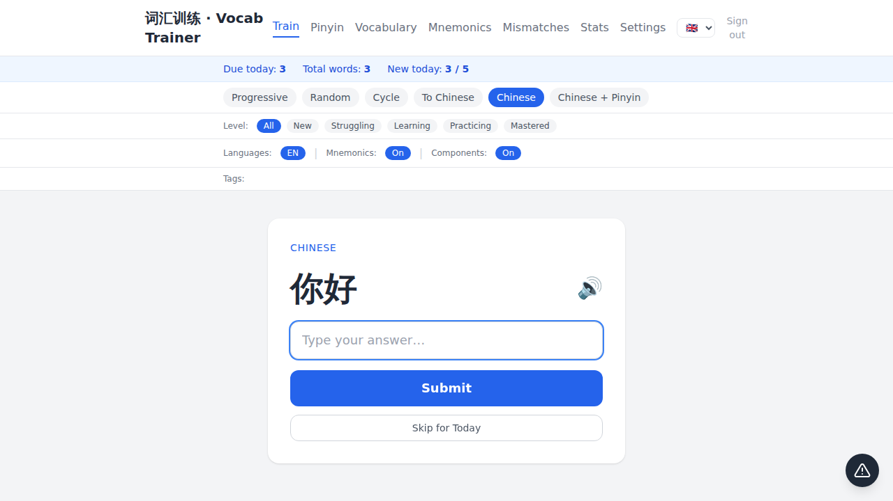
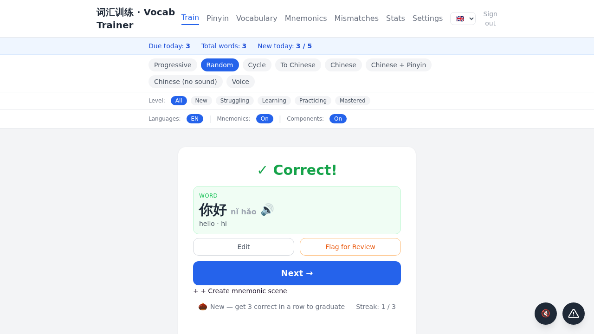
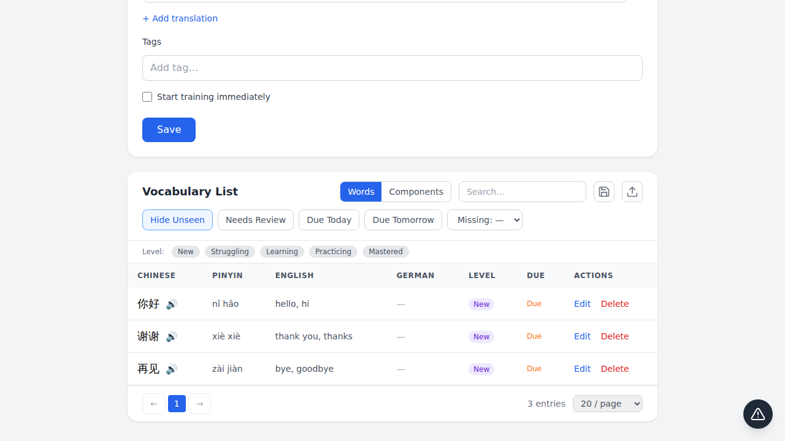
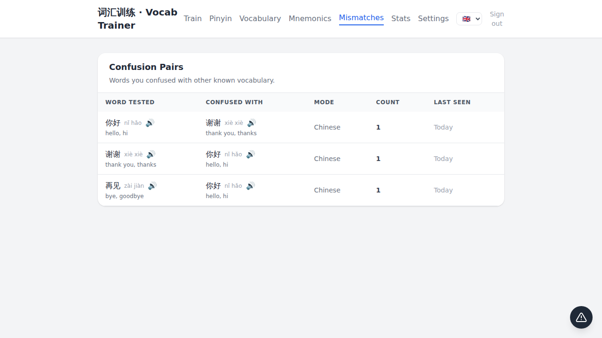

# 词汇训练 · Vocabulary Trainer

This is a self-hosted Chinese-English vocabulary trainer. It uses the SM-2 spaced repetition algorithm.

## Features

- Add vocabulary with Chinese characters, pinyin, and one or more English translations.
- The app supports N:N word relationships. The same English or Chinese word can appear in more than one entry.
- The app has seven quiz modes. You can pick a mode, or let the app pick one at random.
  - **English → Chinese**
  - **Chinese → English**
  - **Chinese (no sound) → English**. This mode is the same as Chinese → English, but it hides the 🔊 play button and never auto-plays audio. Use this mode to drill visual hanzi recognition without an audio cue.
  - **Chinese + Pinyin → English**
  - **Voice → Translation**. The Chinese character is hidden; only the audio plays. You must type the translation from memory. Audio always plays automatically when a card appears. If your device has no speaker, enable "Voice not available" in Settings to fall back to showing the Chinese text (equivalent to Chinese → English).
  - **Progressive**. This mode picks the quiz direction based on your learning progress.
  - **Cycle**. This mode rotates through a sequence of directions that you configure for each word.
- The app uses [SM-2 spaced repetition](https://www.supermemo.com/en/blog/application-of-a-computer-to-improve-the-results-obtained-in-working-with-the-super-memo-method). Words you get wrong appear more often. The app schedules correct answers further into the future.
- **Daily new-word cap.** This setting limits how many new words the app introduces per day. The default is 5 words, and you can configure it with `MAX_NEW_WORDS`. Once you reach the cap, the app serves only already-seen cards for the rest of the day. The training page shows a "New today: X / Y" counter in the stats bar.
- **Difficult-words drill.** Once you review everything due, the "All done for today!" screen offers a "Drill my hardest words" option. Tick the option and pick an amount to flag that many of your hardest words. The app picks about half by lowest accuracy and half by lowest ease factor. The app serves flagged words on demand, regardless of their due date, until you answer each one correctly. A correct answer clears the flag. A temporary "Difficult words" pill in the filter bar shows that the drill is active and shows how many words remain. Click the pill to exit the drill early.
- **Flexible answer matching.** Parenthesized segments are optional: `(das) Essen` accepts `Essen`. Slash- or comma-separated alternatives are each valid: `Essen / Gericht` accepts `Essen` or `Gericht`, and `topic, item` accepts `topic` or `item`.
- **Wrong-answer review.** On a wrong answer, the app shows what you typed next to the correct Chinese text, pinyin, and translations. You can add your answer as an accepted translation with one click. In *Translation → Chinese* mode, the app also shows pinyin beside your typed Chinese answer, so you can see how it is pronounced. If you have two active learning languages (primary and secondary), a language picker lets you choose which language the new translation belongs to. The picker defaults to your primary language.
- **Accept as correct.** If a wrong answer was a typo, click "Accept as correct" to restore your pre-answer SM-2 progress. The app then counts the attempt as correct, with no penalty. You can configure this behavior in Settings: never, on 1-character typos (the default), or always.
- **Training stats.** The app tracks daily progress: attempts, mistakes, accuracy, words known, new words learned, and your best correct streak. The `/stats` page shows a Chart.js bar or line chart of your full history, and a table of the last 14 days.
- **Word-level statistics.** The `/stats` page shows real-time stats for all words you have seen: correctness milestones (1+, 3+, 5+, 10+ correct answers), an accuracy distribution doughnut chart, and the average, median, and P95 of correct answers, attempts, accuracy, and ease factor. The page also shows tables of your 5 hardest and 5 most-practiced words, with translations, and an info box that explains the SM-2 ease factor and all other metrics.
- **Due date distribution.** The `/stats` page shows a bar chart of how many words are due on each day over the next 30 days. Tag filter chips let you narrow the view to specific word groups.
- **Confusion tracking.** If your wrong answer is a valid translation of a different, known word or hanzi component, the app records it as a confusion pair. This works in all quiz modes, including component quizzes. A yellow hint box shows on the result screen right away, and you can see the full history on the `/mismatches` page.
- Every Chinese word has a 🔊 read-aloud button. The button plays a cached MP3 file, generated with Microsoft Edge neural TTS, which is built into the binary. If this fails, the button falls back silently to the browser's Web Speech API.
- **Auto-play sound.** A floating 🔇/🔊 toggle button sits at the bottom-left of the training page, near the report-issue button. This setting is off by default. When you turn it on, the app automatically plays the Chinese pronunciation whenever it shows a new word, component prompt, or introduction. The app never auto-plays the prompt in *Translation → Chinese* mode, because that would reveal the answer before you've answered — and it never auto-plays *Chinese (no sound) → English* prompts, for the same reason that mode hides the play button. Once you submit an answer, if the pronunciation wasn't already auto-played on the question screen (e.g. because it was withheld to avoid revealing the answer, or skipped due to the pinyin-blur setting), the app reads it out on the result screen instead — for both word and component cards. The setting does not persist. It resets to off when you reload the page.
- **Blur pinyin.** This optional setting is in Settings → Training Mode → Quiz Display. It blurs the pinyin hint on quiz cards, so you cannot read it at a glance. Tap or click the hint to reveal it. The hint blurs again on the next card.
- **Bucket growth indicator.** The result screen shows one growth icon (🌰🌱🌿🌳🌸) for each accuracy tier: New, Struggling, Learning, Practicing, or Mastered. The icon marks the current tier of a word, HMM entity, or component, on both correct and wrong answers.
  - **Celebrate bucket changes** is an optional setting, off by default, in Settings → Training Mode → Quiz Display. When a correct answer advances a word's tier, this setting shows a full-screen "Level up!" interstitial before the result screen. The old tier's icon dissolves into the new one.
- **Tags.** You can assign tags to vocabulary words, for example "HSK1", "food", or "travel". You can filter by tag on the vocabulary list and the training page. When you select multiple tags, the app applies OR logic. An autocomplete input creates tags on the fly, and the app removes unused tags automatically.
- **Auto-translate.** When you configure a DeepL API key, an auto-translate button appears in the Add/Edit Word form. The button detects direction automatically: enter Chinese to get the translation and pinyin filled in, or enter the translation to get Chinese and pinyin back. The app generates pinyin locally with [go-pinyin](https://github.com/mozillazg/go-pinyin).
- Vocabulary management: add, edit, delete, search, paginate, and sort by any column. The app shows SM-2 progress per word.
- **Reset a word.** In the Edit Word form, a **Reset** button appears for any word you've already started training. It clears the word's SM-2 progress back to unseen — removing it from every bucket — so it is reintroduced as a brand-new word.
- Due-date and correct-answer scheduling include a small random jitter. This shuffles cards and avoids repetitive review patterns.
- You can bulk-import vocabulary from a structured text file. See `service/cmd/import`.
- **Character breakdown.** On the training screen, a collapsible "Character breakdown" block appears below each Chinese character. Click it to reveal the radical, definition, etymology hint, and component parts with their meanings. This data comes from [makemeahanzi](https://github.com/skishore/makemeahanzi), imported with `service/cmd/import-hanzi`.
- **Hanzi Movie Method mnemonics.** For single-character words, a mnemonic scene builder based on the [Hanzi Movie Method](https://www.mandarinblueprint.com/blog/movie-method/) helps you memorize characters. It maps pinyin initials to **actors**, finals to **locations**, tones to **rooms**, and radicals to **props**. Configure your personal library at `/mnemonics`, and compose scenes in the vocabulary edit form. Saved scenes appear automatically during training: expanded on wrong answers, and collapsed on correct answers. The app remembers your choices globally, so setting an actor for "b" once pre-fills it everywhere. You can also write mnemonic scenes for component characters (radicals and sub-parts) on the component edit tab of the `/vocab` page. Component quiz result cards show these scenes the same way as word scenes.
- **Component training threshold.** Settings (`/settings`) has a "Component Training" card listing every hanzi component that appears anywhere in your current vocabulary, each with a word count and coverage percentage (the share of your Chinese words that require it). Set a minimum coverage threshold (0–100%, default 0 = no filtering) and only components meeting it are added to your training rotation going forward, when a new word starts training. Components already being trained are never removed by this setting, even if their coverage later falls below the threshold — it only affects future additions.
- **Pinyin listening training.** The `/pinyin` page trains tone and sound discrimination. You hear a pinyin syllable and identify it: by multiple choice in the learning phase, or by typing an answer, for example `ba1`, in the review phase. SM-2 spaced repetition tracks your progress per sound, across about 1,600 syllable and tone combinations from the public-domain [mp3-chinese-pinyin-sound](https://github.com/davinfifield/mp3-chinese-pinyin-sound) collection. You can filter by consonant group, for example b/p/m/f or zh/ch/sh/r. The page also tracks confusion between commonly mixed-up sounds.
- HSK vocabulary import (HSK 1-6) fetches vocabulary directly from mandarinbean.com and applies `hsk-N` tags automatically. See `service/cmd/import-hsk`.
- Optional single-user password protection. Set `AUTH_USER` and `AUTH_PASSWORD` in `.env`.
- The app stores its SQLite database on the host filesystem.
- The app runs in Docker or natively. The static frontend is embedded in the Go binary, so the app needs no Python or other external tools.
- Deploy to a Raspberry Pi with `make release`. This target cross-compiles for `linux/arm64` and rsyncs the binary over SSH.

## Screenshots

Training — question


Training — answer


Vocabulary management |


Overview - Vocabulary Mismatches


## Quick start

**Requirements:** Docker and Docker Compose.

```bash
git clone <repo-url>
cd vocabulary_trainer
make run
```

Then open [http://localhost:8080](http://localhost:8080).

1. Go to **Vocabulary** (`/vocab`) and add some words.
2. Return to **Train** (`/`) to start a quiz session.
3. Check **Mismatches** (`/mismatches`) to review words you confused with each other.

The app stores the SQLite database in `./data/vocab.db` on your host.

## Authentication

Authentication is disabled by default. To enable it, set `AUTH_USER` and `AUTH_PASSWORD` in your `.env` file:

```bash
AUTH_USER=admin
AUTH_PASSWORD=yourpassword
```

When you enable authentication, all pages and API endpoints require a valid session. The app redirects unauthenticated page requests to `/login`. Unauthenticated API requests receive `401 Unauthorized`. Sessions expire after 24 hours.

### Production hardening

For any deployment that is not your local dev box, set these values:

```bash
APP_ENV=production            # default; refuses startup if SESSION_SECRET is missing
SESSION_SECRET=<64 hex chars>  # `openssl rand -hex 32`
```

`APP_ENV=dev` is the explicit opt-out for local development. In this mode, the app tolerates a missing `SESSION_SECRET` and regenerates a random key on each restart. It also lets `/api/register` auto-verify accounts when SMTP is not configured, and it omits the `Secure` flag on session cookies, so they work over plain HTTP. In production, which is the default, the app marks session cookies `Secure`, so you must serve the app over HTTPS. Terminate TLS at the reverse proxy.

**Never set `APP_ENV=dev` on a public deployment.** In dev mode, anyone can register without owning the email address, and session cookies travel over unencrypted HTTP.

Other security-relevant settings:

```bash
RATE_LIMIT_AUTH_PER_MIN=10        # IP-budget for /api/login, /api/register, /api/verify-email
RATE_LIMIT_USER_PER_MIN=300       # per-user budget for all other API traffic
RATE_LIMIT_EXPENSIVE_PER_MIN=20   # budget for /api/translate, /api/change-password, LLM scene generation
RATE_LIMIT_GITHUB_ISSUE_PER_MIN=5 # budget for issue reports, enforced per user AND per IP
CSV_MAX_UPLOAD_MB=8               # max CSV upload body size; oversized uploads are rejected (413)
CSV_MAX_ROWS=5000                 # max data rows per CSV upload; over-cap uploads are rejected (400)
```

The CSV import endpoint (`POST /api/words/upload-csv`) also uses the expensive-request rate limiter. Its per-row text-to-speech generation runs in a bounded background worker pool, so a large import cannot exhaust resources.

The app has a built-in lockout for failed logins: five wrong passwords lock the account for 15 minutes. The next successful login clears the lockout.

The app caps JSON request bodies on `/api` routes, at 1 MiB by default, so an unbounded upload cannot exhaust memory. Oversized bodies get a `400` response.

```bash
MAX_BODY_BYTES=1048576   # max /api request body in bytes (default 1 MiB)
```

The HTTP server runs with read, write, and idle timeouts, so a slow or stalled client cannot tie up the single SQLite connection. It also shuts down gracefully on `SIGINT` and `SIGTERM`, draining in-flight requests for up to 30 seconds before it exits. This lets systemd auto-restarts (see `deploy/vocab-trainer.service`) drop fewer in-flight requests.

The app sets a strict `Content-Security-Policy` header on every response, along with `X-Frame-Options: DENY`, `X-Content-Type-Options: nosniff`, `Referrer-Policy: strict-origin-when-cross-origin`, and `Permissions-Policy: geolocation=(), microphone=(), camera=()`. Configure HTTPS at the reverse proxy — see `deploy/nginx.conf`, which also sets `Strict-Transport-Security`.

Always deploy behind a reverse proxy, for example nginx, that sets `X-Real-IP` to the real client address. Rate limiting reads the client IP from that header. Do not expose the binary directly to the internet. The app deliberately never trusts the spoofable `X-Forwarded-For` header, so a directly-exposed binary would rate-limit on `RemoteAddr` only.

## Daily new-word cap

Each user sets their own daily new-word limit, in **Settings → Daily Learning**. The default is 5 words. The server-wide `MAX_NEW_WORDS` environment variable sets the default for new accounts only. Users can change it higher or lower in their own settings.

```bash
MAX_NEW_WORDS=5   # default for new accounts
```

A *new word* is one that has never appeared as a quiz card before. The app tracks this with a `first_seen_date` column in the database. Once you reach the daily cap, the app serves only cards you have already seen at least once. Reviews and retry cards are always available, regardless of the cap. The counter resets at midnight, server-local date.

The training page stats bar shows **New today: X / Y**, so you can see how many new words you have left for the day.

### Baseline gates

In **Settings → Daily Learning**, each user can enable optional gates. These gates pause new-word introductions when the review load is high. You enable each gate independently, with its own numeric threshold. All active gates must pass before the app shows a new word. When you train a specific tag filter, each gate's count only includes words matching that filter — words tagged outside your current session (for example, an untrained HSK level) never count against the threshold.

| Gate | Blocks new words when… |
|---|---|
| **Max due words at day start** | The number of review cards due when you first opened the app today is ≥ the threshold |
| **Max Struggling words** | Your current Struggling bucket count is ≥ the threshold |
| **Max Learning words** | Your current Learning bucket count is ≥ the threshold |
| **Max New bucket words** | Your current New bucket count (already-introduced words that haven't graduated past the initial learning phase yet) is ≥ the threshold |

### Cooldown between new words

In **Settings → Daily Learning**, the **Cooldown between new words** field sets the minimum time between new-word introductions. The default is 1 minute. During the cooldown window, the app serves only review cards. Set the value to **0** to disable the cooldown and allow new words back-to-back.

### Skip button for new words

By default, a **Skip** button appears on the new-word introduction screen. It lets you defer a word for 7 days. In **Settings → Daily Learning**, you can hide this button. When you hide it, you cannot skip new words, and you must review them.

### Session extension (avoid immediate repetition)

Near the end of a session, if the only review card left due today is the one you just answered, the app serves a not-yet-due word instead of repeating it right away. The **Due today** counter on the training page accounts for this, so the number you see always matches what the app will actually ask. In **Settings → Daily Learning**, the **Add extra words at the end of a session to avoid repetition** toggle controls this behavior. It is on by default. Turn it off to receive only genuinely due-today words, even if that means the app occasionally repeats one right away.

## Progressive mode

The **Progressive** quiz mode introduces new words gently and increases difficulty gradually, based on your accuracy (correct answers divided by total attempts). By default, the app behaves as follows:

| Condition | What happens |
|---|---|
| Brand new word (`total_attempts = 0`) | **Introduction** — shows Chinese, pinyin, and all translations. No quiz. Choose "Got it" to start learning or "Skip" to defer 7 days. |
| **Learning phase** (`learning_new_word = true`) | The word is in the **New** bucket. Short retry intervals (minutes, not days) let you drill it in one session. Three correct answers in a row graduate the word. A wrong answer resets the streak. |
| `total_attempts < 3` | **Translation → Chinese** — not enough data yet, so the app uses the easiest direction |
| Accuracy < 50% | **Translation → Chinese** — you are still struggling |
| Accuracy < 70% **or** `total_attempts < 10` | **Chinese + Pinyin → Translation** — you are making progress |
| Accuracy < 85% (and `total_attempts ≥ 10`) | **Chinese → Translation** — reliable; you see Chinese only |
| Accuracy ≥ 85% and `total_attempts ≥ 10` | **Random** — any of the three quiz directions |

You can customize the quiz format for each tier, and for each step of the new-word learning phase, in **Settings → Training Mode**. The available formats are: *Translation → Chinese*, *Chinese → Translation*, *Chinese + Pinyin → Translation*, *Translation → Chinese (pinyin hint)*, and *Random*.

**Learning phase ("New" bucket):**

When you acknowledge a new word by clicking "Got it," it enters the learning phase. During this phase:

- The app uses short intervals (1-5 minutes) instead of day-scale SM-2 intervals.
- You need **3 consecutive correct answers** to graduate.
- A wrong answer resets the streak counter to 0.
- On graduation, the app resets SM-2 progress to a clean baseline. Accuracy starts at 100%, `total_attempts` is set to 3, and the word moves to the regular review queue with a 1-day interval.

The training page and vocabulary list show a **New** tier badge for words still in the learning phase. You can filter by the "New" bucket to drill only recently introduced words.

**Accuracy tiers:**

Tier assignment uses **effective accuracy**, calculated as `(total_correct + streak_bonus) / total_attempts`. The `streak_bonus` speeds up recovery from initial mistakes. See "Streak bonus" below.

| Tier | Criteria |
|---|---|
| **New** | `learning_new_word = true` (still in learning phase) |
| **Struggling** | `< 3 attempts` or `effective accuracy < 50%` |
| **Learning** | `≥ 3 attempts` and `50% ≤ effective accuracy < 70%` |
| **Practicing** | `≥ 10 attempts` and `70% ≤ effective accuracy < 85%` |
| **Mastered** | `≥ 10 attempts` and `effective accuracy ≥ 85%` |

**Streak bonus:**

When you answer a word correctly several times in a row, the app grants a `streak_bonus`. This bonus boosts effective accuracy to match the bucket for your current streak length.

| Consecutive correct (streak) | Target bucket | Min effective accuracy |
|---|---|---|
| < 3 | _(no boost)_ | — |
| 3-5 | Learning | 50% |
| 6-8 | Practicing | 70% |
| ≥ 9 | Mastered | 85% |

The app calculates the bonus as the minimum value needed to reach the target accuracy threshold. The bonus never decreases. Once you earn it, it persists even if the streak later breaks. However, wrong answers dilute the bonus over time, because `total_attempts` grows while `streak_bonus` stays fixed. The training page shows effective accuracy with a "(+N streak bonus)" indicator when a bonus is active.

**Skip vs Got it:**

- **Got it** marks the word as introduced, starts the learning phase, and makes the word available for quizzing right away (EN → ZH). This counts toward the daily new-word cap.
- **Skip** defers the word by 7 days. This does *not* count as seen. The word remains "new," and the app shows it as an introduction again when it comes due.

**Skip for Today:** Below the Submit button on the training card, a secondary **Skip for Today** button defers the current card (word, HMM mnemonic, or component) by 1 day, without recording an attempt. Use this to clear a stuck card from today's queue and try again tomorrow.

## Cycle mode

The **Cycle** quiz mode rotates through a fixed sequence of quiz directions. By default, the position advances on every attempt, correct or wrong, so the counter is `total_attempts`. In Settings → Cycle Mode, you can switch to **advance on success only**. This mode uses `total_correct` as the counter instead, so the step stays the same until you answer correctly.

Default sequence: **Chinese + Pinyin → Translation → Chinese → Translation → Chinese → Translation**

| `total_attempts` | Position | Direction |
|---|---|---|
| 1 (after "Got it") | 0 | Chinese + Pinyin → Translation |
| 2 | 1 | Translation → Chinese |
| 3 | 2 | Chinese → Translation |
| 4 | 0 (wraps) | Chinese + Pinyin → Translation |

You can configure the 3-step sequence in **Settings → Cycle Mode**. The available directions are: *Translation → Chinese*, *Chinese → Translation*, *Chinese + Pinyin → Translation*, and *Translation → Chinese (pinyin hint)*. The same settings panel has an **Advance only on success** toggle. This toggle switches the counter from `total_attempts` to `total_correct`.

## User settings

Each user has a personal settings page (`/settings`) with these sections:

- **Language preferences.** Choose a primary and a secondary language. The app shows the primary language first in the vocabulary list, and uses it as the default quiz language. Both languages are accepted as quiz answers.
- **Training mode.** Customize the quiz format for each proficiency tier, for progressive mode, and for each step in the new-word introduction phase. This section includes "Blur pinyin until tapped" and "Celebrate bucket changes" (a level-up interstitial when a word's accuracy tier advances) under Quiz Display.
- **Cycle mode.** Configure the 3-step direction sequence used by the Cycle quiz mode. Choose whether the cycle advances on every attempt (the default) or only after a correct answer.
- **Daily Learning.** Set the number of new words per day, set a cooldown between new-word introductions, toggle the skip button for new words, and toggle session extension (which serves an extra not-yet-due word at the end of a session instead of repeating one right away). You can also configure baseline gates (due-today, struggling, learning, new bucket) that pause introductions when the review load is high.
- **Gamification.** Enable a word-matching mini-game that appears during training after you confuse at least 3 word pairs in the last 7 days. Configure how often, in minutes, the game may interrupt training. When the game triggers, it shows three confused pairs in two shuffled columns. Click a Chinese word, then its English translation, to match them. Correct pairs turn green, and wrong pairs flash red. If a word shares its translation text with another still-unmatched word, claiming that word's box alone does not complete the match. Instead, the box flashes yellow, so you cannot claim it out from under the word it actually belongs to. The game updates SM-2 progress for each matched word.
- **API keys.** Store a personal DeepL API key and an LLM provider key (OpenAI, Anthropic, Gemini, or a local OpenAI-compatible server). The app encrypts these keys with a key derived from your login password, using PBKDF2-SHA256 and AES-GCM, and makes them accessible only while you are logged in. Users with a personal key can use DeepL translation and LLM scene generation without a plus account. A user-supplied local LLM URL must be a public `http(s)` address. The app rejects and blocks internal, loopback, and link-local targets, to prevent server-side request forgery. If you run a trusted local model on loopback, configure it with the server-side `LOCAL_LLM_URL` environment variable instead.

## Auto-translate (DeepL)

Set `DEEPL_API_KEY` in your `.env` file to enable the auto-translate button on the vocabulary page:

```bash
DEEPL_API_KEY=your-deepl-api-key
DEEPL_TARGET_LANGUAGE=de   # any DeepL language code; default: en
```

When you enable this feature, an **Auto-translate** button appears in the Add/Edit Word form. The button detects direction automatically, based on which fields are filled:

- **Chinese filled, translation empty** → the app translates Chinese to the target language and generates pinyin. The backend uses DeepL's `custom_instructions` to request up to 3 distinct meanings, and each meaning fills a separate translation field automatically.
- **Translation filled, Chinese empty** → the app translates to Chinese and generates pinyin.
- **Both filled** → the app generates pinyin only.

The app supports both free-tier (`:fx`) and pro API keys automatically. It generates pinyin server-side, using [go-pinyin](https://github.com/mozillazg/go-pinyin). The API key never reaches the browser. The backend proxies all DeepL calls.

## In-app issue reporting (GitHub)

When you configure this feature, a floating **report** button appears on every authenticated page. When a user clicks the button, the app captures the current page: the URL, a screenshot, and non-sensitive client context (user agent, viewport, locale, timestamp). The user picks a type — **bug**, **idea**, **question**, or **misc** — and writes a title and description. On submit, the app creates a GitHub issue server-side.

```bash
GITHUB_TOKEN=github_pat_...      # fine-grained PAT; required to enable the feature
GITHUB_ISSUE_REPO=owner/repo     # target repository; required to enable the feature
GITHUB_ISSUE_LABELS=from-app     # comma-separated labels applied to created issues (default: from-app)
GITHUB_ASSETS_BRANCH=issue-assets # branch screenshots are uploaded to (default: issue-assets)
GITHUB_API_BASE_URL=             # override the GitHub API base (tests/GitHub Enterprise); default https://api.github.com
GITHUB_ISSUE_MAX_BODY_MB=6       # max request body for issue submission (screenshots are several MB)
```

This feature is optional. If `GITHUB_TOKEN` or `GITHUB_ISSUE_REPO` is unset, the report button stays hidden, and `POST /api/github/issues` returns `503`. Any authenticated user can submit a report. The app rate-limits submissions **per user and per IP**, using `RATE_LIMIT_GITHUB_ISSUE_PER_MIN`, with a default of 5 per minute.

The token must be a fine-grained PAT, scoped to the single target repository, with **Issues: write** and **Contents: write** permissions. The token never reaches the browser. GitHub's Issues API cannot attach images, so the app uploads screenshots through the Contents API to `GITHUB_ASSETS_BRANCH`, which it creates automatically from the default branch if the branch is missing. The app embeds these screenshots in the issue body by URL. They accumulate as blobs on that branch, never on the default branch, and you can prune them periodically. Each report carries a random UUID embedded in the issue body. The app records the UUID-to-user mapping only in the private audit log, so no email address or internal account ID appears in the, potentially public, issue.

## LLM scene generation

The Hanzi Movie Method scene builder can call an LLM to generate mnemonic scenes automatically. Set one of the following provider configurations to enable the **Generate scene** button:

**Cloud providers** (one key is enough):

```bash
OPENAI_API_KEY=sk-...
# or
ANTHROPIC_API_KEY=sk-ant-...
# or
GEMINI_API_KEY=AI...
```

**Local / private model** (this takes priority over cloud keys when set):

```bash
LOCAL_LLM_URL=http://localhost:11434   # base URL of your local server
LOCAL_LLM_MODEL=llama3.1               # model name as known to that server
LOCAL_LLM_API_KEY=                     # optional bearer token (e.g. LM Studio)
```

You must set both `LOCAL_LLM_URL` and `LOCAL_LLM_MODEL` to activate the local provider. The server must expose an OpenAI-compatible chat completions endpoint at `POST /v1/chat/completions`. This works with [Ollama](https://ollama.com), [LM Studio](https://lmstudio.ai), [LocalAI](https://localai.io), vLLM, and any other OpenAI-compatible server.

When you configure a local model, it takes precedence over any cloud API keys that are also present. If the local server is unreachable, or returns an error when the app requests a scene, the app tries the next configured provider automatically. No restart is required.

## Makefile targets

| Target | Description |
|---|---|
| `make build` | Build the Docker image |
| `make run` | Start the app in the background |
| `make stop` | Stop the running container |
| `make logs` | Tail container logs |
| `make dev` | Run locally without Docker (requires Go 1.24+) |
| `make tidy` | Tidy Go module dependencies |
| `make import` | Import vocabulary from a text file (see below) |
| `make import-hsk` | Fetch and import HSK 1-6 vocabulary from mandarinbean.com (see below) |
| `make import-pinyin` | Import pinyin audio files for listening training (see below) |
| `make release` | Cross-compile for Raspberry Pi and rsync to `RSYNC_DEST` |
| `make test` | Run all Go and JS tests |
| `make clean` | Stop containers and remove build artifacts |

## Bulk import

You can import vocabulary from a plain-text file, in this format (3 lines per entry, blank lines ignored):

```
pinyin / 汉字
translation(s), comma-separated
rating string (ignored)
```

```bash
# Default: reads voc.txt, writes to data/vocab.db
make import

# Custom paths
make import FILE=my_vocab.txt DB=data/vocab.db

# Preview without writing
go run ./service/cmd/import -db data/vocab.db -file voc.txt -dry-run
```

Duplicate detection prevents the app from re-inserting entries where both the Chinese text or pinyin and the English translation already exist.

## HSK vocabulary import

This tool fetches vocabulary directly from [mandarinbean.com](https://mandarinbean.com) and inserts it into the database. It tags each word `hsk-1` through `hsk-6`. If a word already exists, the tool still applies the tag. If the exact Chinese-English pair already exists, the tool skips the row.

```bash
# Import all HSK levels (1-6)
make import-hsk

# Import only HSK 1 and 2
make import-hsk LEVELS=1,2

# Import with German translations (requires DEEPL_API_KEY)
DEEPL_API_KEY=your-key go run ./service/cmd/import-hsk -lang de

# Custom DB path
make import-hsk DB=/path/to/vocab.db

# Preview without writing
go run ./service/cmd/import-hsk -dry-run

# Single level, dry-run
go run ./service/cmd/import-hsk -levels 3 -dry-run
```

Flags:

| Flag | Default | Description |
|---|---|---|
| `-db` | `data/vocab.db` | Path to SQLite database |
| `-levels` | `1,2,3,4,5,6` | Comma-separated HSK levels to import |
| `-lang` | `en` | DeepL target language code (e.g. `de`, `fr`, `es`); requires `DEEPL_API_KEY` env var |
| `-dry-run` | false | Parse and check duplicates without writing |

When you set `-lang` to anything other than `en`, the tool translates each English translation from the source table with the [DeepL API](https://www.deepl.com/en/products/api) before storing it. The tool always stores translations as `language='en'` rows, so the existing quiz logic works unchanged. If `DEEPL_API_KEY` is not set, the tool uses the original English text and prints a warning.

### Character decomposition import (makemeahanzi)

This tool imports character decomposition data from the [makemeahanzi](https://github.com/skishore/makemeahanzi) project's `dictionary.txt` file. It enables the "Character breakdown" feature on the training screen.

1. Download `dictionary.txt` from the makemeahanzi repository into the project root.
2. Run the import:

```bash
make import-hanzi                          # uses dictionary.txt in project root
make import-hanzi FILE=/path/to/dictionary.txt  # custom path
```

Or directly:

```bash
cd service && go run ./cmd/import-hanzi -db ../data/vocab.db -file ../dictionary.txt
```

| Flag | Default | Description |
|---|---|---|
| `-db` | `data/vocab.db` | Path to SQLite database |
| `-file` | *(required)* | Path to makemeahanzi `dictionary.txt` |
| `-dry-run` | false | Parse and validate without writing |

### Pinyin audio import

This tool imports pinyin pronunciation audio files from the public-domain [mp3-chinese-pinyin-sound](https://github.com/davinfifield/mp3-chinese-pinyin-sound) collection. It enables the `/pinyin` listening training page.

1. Clone the audio repository:
```bash
git clone https://github.com/davinfifield/mp3-chinese-pinyin-sound.git
```

2. Import the audio files:
```bash
make import-pinyin SOURCE=mp3-chinese-pinyin-sound/mp3
```

Or directly:
```bash
cd service && go run ./cmd/import-pinyin -source ../mp3-chinese-pinyin-sound/mp3
```

| Flag | Default | Description |
|---|---|---|
| `-db` | `data/vocab.db` | Path to SQLite database |
| `-source` | `mp3` | Directory containing pinyin MP3 files (e.g. `ba1.mp3`) |
| `-audio-dir` | `data/pinyin-audio` | Destination directory for audio files |
| `-dry-run` | false | Parse files without writing to DB or copying |

The app stores audio files in `PINYIN_AUDIO_DIR` (default: `data/pinyin-audio/`). Set this environment variable to override the default location.

## Deploy to Raspberry Pi

### Initial setup

Locally, copy `.env.example` to `.env` and set `RSYNC_DEST` to configure the deployment target. Note that `make release` syncs only `.env.example`, not `.env`.

```bash
cp .env.example .env
# edit: RSYNC_DEST=pi@raspberrypi.local:/opt/vocab-trainer
```

Run `make release` to copy all needed files.

This target cross-compiles for `linux/arm64` and rsyncs the binary, plus `deploy/nginx.conf` and `deploy/vocab-trainer.service`, to the Pi. Follow the printed instructions to install the systemd service, which auto-restarts when the binary updates, and the nginx reverse proxy.

> If your Pi runs a 32-bit OS, change `GOARCH=arm64` to `GOARCH=arm GOARM=7` in the Makefile.

Copy the `.env.example` file and adjust the settings:

```
cp <deploy-dir>/.env.example <deploy-dir>/.env
```

Then copy or move the service files, and edit them if needed to fix the path and port settings:

```
sudo cp <deploy-dir>/vocab-trainer.service /etc/systemd/system/
sudo cp <deploy-dir>/vocab-trainer-watcher.service /etc/systemd/system/
sudo cp <deploy-dir>/vocab-trainer-watcher.path /etc/systemd/system/
sudo systemctl daemon-reload
sudo systemctl enable --now vocab-trainer
sudo systemctl enable --now vocab-trainer-watcher.path vocab-trainer-watcher.service
sudo systemctl start --now vocab-trainer
sudo systemctl start --now vocab-trainer-watcher.path vocab-trainer-watcher.service
```

To install the nginx config:

```
sudo cp <deploy-dir>/nginx.conf /etc/nginx/sites-available/vocab-trainer
sudo ln -sf /etc/nginx/sites-available/vocab-trainer /etc/nginx/sites-enabled/vocab-trainer
sudo nginx -t && sudo systemctl reload nginx
```

### Release changes

Running `make release` is enough to build the binary, deploy it, and restart the service.

### Backups

The database is a single SQLite file, so backups are simple. The project provides a scheduled nightly backup with retention:

```bash
sudo cp deploy/backup.sh /opt/vocab-trainer/backup.sh
sudo cp deploy/vocab-backup.service /etc/systemd/system/
sudo cp deploy/vocab-backup.timer   /etc/systemd/system/
sudo systemctl daemon-reload
sudo systemctl enable --now vocab-backup.timer
```

`deploy/backup.sh` uses the SQLite online-backup API (`sqlite3 .backup`), which takes a consistent snapshot while the server runs and is safe with WAL mode. It writes timestamped copies to `BACKUP_DIR` (default `data/backups/`) and prunes files older than `RETAIN_DAYS` (default 14 days). The `vocab-backup.timer` runs it nightly.

**Restore.** Stop the server, copy a backup over the live database, and restart:

```bash
sudo systemctl stop vocab-trainer
make restore FROM=data/backups/vocab-2026-06-15_033000.sq3   # or: cp <backup> data/vocab.db
sudo systemctl start vocab-trainer
```

A unit test (`TestBackupRestore_RoundTrip`) covers the backup and restore round-trip, using the same online-backup primitive.

## Text-to-speech (TTS)

The app generates audio with the Microsoft Edge neural TTS WebSocket API, using the `zh-CN-XiaoxiaoNeural` voice. This is implemented directly in Go, with no Python dependency or API key required. The app caches MP3 files in `AUDIO_DIR` (default: `data/audio/`) and serves them from the Go server.

TTS is always enabled. Set `AUDIO_DIR` to control where the app stores cached MP3 files:

```bash
AUDIO_DIR=/data/audio  # default when using Docker
```

## Running without Docker

This requires Go 1.24 or later.

```bash
make dev
```

The server listens on `:8080` and stores the database at `data/vocab.db`.

## Project structure

```
vocabulary_trainer/
├── service/                 # All Go source and embedded frontend
│   ├── main.go              # Server entry point, router, embedded static files
│   ├── go.mod / go.sum
│   ├── handlers/
│   │   ├── quiz.go          # GET /api/quiz/next, POST /api/quiz/answer, GET /api/quiz/stats
│   │   ├── pinyin_quiz.go   # GET /api/pinyin-quiz/next, POST /api/pinyin-quiz/answer, GET /api/pinyin-quiz/stats
│   │   ├── words.go         # CRUD /api/words + POST /api/words/{id}/translations
│   │   ├── hmm.go           # Hanzi Movie Method — library CRUD, scene builder, pinyin parsing
│   │   ├── mismatches.go    # GET /api/mismatches
│   │   ├── translate.go     # POST /api/translate, GET /api/config — DeepL proxy + pinyin
│   │   ├── audio.go         # GET /api/audio/{id} — serve/generate cached MP3; GET /api/audio/component/{char} — component TTS
│   │   └── hanzi.go         # GET /api/hanzi/decompose — character decomposition
│   ├── models/models.go     # Shared structs and mode constants
│   ├── sm2/
│   │   ├── sm2.go           # SM-2 algorithm, answer checking, variant expansion
│   │   └── pinyin.go        # Tone mark conversion, pinyin answer parsing
│   ├── tts/tts.go           # Microsoft Edge TTS WebSocket client
│   ├── db/
│   │   ├── migrate.go       # Version-based schema migrations
│   │   ├── db.go            # Data access layer (Store) — vocabulary
│   │   └── pinyin.go        # Data access layer — pinyin listening
│   ├── cmd/import/main.go   # Standalone vocabulary import tool (text file)
│   ├── cmd/import-hsk/main.go # HSK vocabulary import from mandarinbean.com
│   ├── cmd/import-hanzi/main.go # makemeahanzi character decomposition import
│   ├── cmd/import-pinyin/main.go # Pinyin audio import tool
│   └── frontend/
│       ├── index.html       # Training page
│       ├── pinyin.html      # Pinyin listening training page
│       ├── vocab.html       # Vocabulary management page
│       ├── mnemonics.html   # HMM mnemonic library settings page
│       ├── mismatches.html  # Confusion pairs page
│       ├── stats.html       # Training stats page
│       ├── app.js           # Shared fetch utilities and DOM helpers
│       ├── train.js         # Training page logic
│       ├── pinyin.js        # Pinyin listening training logic
│       ├── vocab.js         # Vocabulary management logic
│       ├── hmm-builder.js   # Reusable HMM scene builder component
│       ├── mnemonics.js     # HMM library settings page logic
│       ├── mismatches.js    # Confusion pairs page logic
│       └── stats.js         # Training stats page logic
├── deploy/
│   ├── nginx.conf           # Sample nginx reverse-proxy config
│   └── vocab-trainer.service # systemd unit (auto-restart on binary change)
└── Dockerfile / docker-compose.yml
```

## Usage tracking

The app records every request internally, in the `usage_events` table (`user_id`, `name`, `count`, `last_seen`). This lets admins see which pages and endpoints are actually used. The `name` field holds the HTTP method plus the matched route, for example `GET /train` or `POST /api/quiz/answer`. Hits for the same user and route aggregate into one row, with an incrementing `count` and a refreshed `last_seen`. The app records anonymous requests with `user_id = 0`. It excludes static asset requests and audio-streaming routes (`/api/audio/*`, `/api/pinyin-quiz/audio/*`) as noise. There is currently no UI or API endpoint for viewing this data. You must query the database directly.

## API

| Method | Path | Description |
|---|---|---|
| `GET` | `/api/quiz/next` | Get the next card to study (`mode`, `tags` query params; `difficult=true` serves only flagged difficult-drill words) |
| `POST` | `/api/quiz/answer` | Submit an answer (a correct answer clears the word's difficult-drill flag) |
| `GET` | `/api/quiz/match-game` | Get up to 3 recent confusion pairs for the match mini-game (empty if < 3 pairs in last 7 days); tiles may be words or hanzi components |
| `POST` | `/api/quiz/match-answer` | Submit a match-game result — `{zh_word_id, correct}` for a word tile, or `{kind: "component", character, correct}` for a component tile — updates SM-2 or component progress |
| `POST` | `/api/quiz/accept-correct` | Accept a wrong answer as correct (typo), restoring pre-answer SM-2 progress |
| `GET` | `/api/quiz/langs` | List the distinct translation languages available |
| `POST` | `/api/quiz/skip` | Skip a word (defer due date by `days`, default 7) |
| `POST` | `/api/quiz/acknowledge` | Mark a new word as introduced (ready for quizzing) |
| `POST` | `/api/quiz/acknowledge-random` | Acknowledge a random subset of new words (start-training count) |
| `POST` | `/api/quiz/advance` | Advance due dates / move past the current card |
| `POST` | `/api/quiz/difficult` | Flag the user's hardest words for a focused drill (`count` body field — about half by lowest accuracy, half by lowest ease factor); returns `{flagged}` |
| `POST` | `/api/quiz/difficult/clear` | End the difficult-words drill by clearing all drill flags |
| `GET` | `/api/quiz/stats` | Get due-today and total card counts (`tags` query param); includes `difficult_remaining` (flagged drill words still to answer) |
| `GET` | `/api/quiz/daily-stats` | Get daily training stats history (attempts, mistakes, words known, new words, streak) |
| `GET` | `/api/quiz/word-stats` | Get per-word aggregate statistics: milestones, accuracy buckets, avg/median/P95, hardest & most-practiced words |
| `GET` | `/api/quiz/due-date-distribution` | Get word counts grouped by due date for the next 30 days (`tags` query param) |
| `GET` | `/api/component/due-date-distribution` | Get seen hanzi component counts grouped by due date for the next 30 days |
| `GET` | `/api/components/coverage` | List every hanzi component appearing in the user's current zh vocabulary with word count, coverage percentage, and whether it's already in training — used by the Settings page's component training threshold |
| `GET` | `/api/words` | List words (`q`, `page`, `per_page`, `sort`, `order`, `tags` query params) |
| `POST` | `/api/words` | Create a vocabulary entry |
| `POST` | `/api/words/upload-csv` | Bulk import from a CSV file (multipart: `file`, `tags`, `start_training_count`) |
| `GET` | `/api/words/{id}` | Get a single word with translations |
| `PUT` | `/api/words/{id}` | Update a word |
| `DELETE` | `/api/words/{id}` | Delete a word |
| `POST` | `/api/words/{id}/translations` | Add a single English translation to an existing word |
| `POST` | `/api/words/{id}/review` | Flag a word for review |
| `POST` | `/api/words/{id}/reset` | Reset a word's SM-2 progress to unseen — removes it from every bucket and reintroduces it as new |
| `GET` | `/api/audio/{id}` | Serve cached MP3 for a Chinese word (generated on demand) |
| `GET` | `/api/audio/component/{char}` | Serve cached MP3 for a single component character (generated on demand); files stored as `c_{hex}.mp3` |
| `GET` | `/api/hmm/breakdown` | Hanzi Movie Method breakdown (actor/location/room/props) for a word |
| `GET` | `/api/tags` | List all tag names (alphabetically) |
| `GET` | `/api/config` | Frontend feature flags (`deepl_enabled`, etc.) |
| `POST` | `/api/translate` | Translate text via DeepL + generate pinyin (only available when `DEEPL_API_KEY` is set) |
| `GET` | `/api/github/config` | Whether in-app issue reporting is enabled (`{"enabled":bool}`) |
| `POST` | `/api/github/issues` | Create a GitHub issue from an in-app report (only available when `GITHUB_TOKEN` + `GITHUB_ISSUE_REPO` are set; rate-limited per user and per IP) |
| `GET` | `/api/mismatches` | List all recorded confusion pairs (wrong answers that matched a different known word or hanzi component) |
| `GET` | `/api/hanzi/decompose` | Decompose Chinese characters into radicals and components (`chars` query param, max 20) |
| `GET` | `/api/hmm/actors` | List all HMM actor mappings (pinyin initial → person) |
| `PUT` | `/api/hmm/actors/{initial}` | Update actor name for an initial |
| `GET` | `/api/hmm/locations` | List all HMM location mappings (pinyin final → place) |
| `PUT` | `/api/hmm/locations/{final}` | Update location name for a final |
| `GET` | `/api/hmm/tone-rooms` | List all HMM tone room mappings (tone → room) |
| `PUT` | `/api/hmm/tone-rooms/{tone}` | Update room name for a tone |
| `GET` | `/api/hmm/props` | List all HMM prop mappings (radical → object) |
| `PUT` | `/api/hmm/props` | Create or update a prop mapping |
| `DELETE` | `/api/hmm/props/{radical}` | Delete a prop mapping |
| `GET` | `/api/words/{id}/hmm/context` | Get HMM scene context for a word (parsed pinyin, radicals, library lookups) |
| `PUT` | `/api/words/{id}/hmm` | Save mnemonic scene and auto-update library |
| `DELETE` | `/api/words/{id}/hmm` | Delete mnemonic scene |
| `GET` | `/api/components/{char}/hmm-scene` | Get the saved mnemonic scene text for a component character |
| `PUT` | `/api/components/{char}/hmm-scene` | Save (or replace) a mnemonic scene text for a component character |
| `DELETE` | `/api/components/{char}/hmm-scene` | Delete the mnemonic scene for a component character |
| `GET` | `/api/pinyin-quiz/next` | Get the next pinyin sound to study (`tags` query param) |
| `POST` | `/api/pinyin-quiz/answer` | Submit a pinyin listening answer |
| `GET` | `/api/pinyin-quiz/stats` | Get pinyin due-today and total counts (`tags` query param) |
| `GET` | `/api/pinyin-quiz/audio/{filename}` | Serve a pinyin pronunciation MP3 file |
| `GET` | `/api/pinyin-quiz/tags` | List pinyin consonant group tags |
| `GET` | `/api/settings` | Get user settings (language prefs, quiz modes, masked API key status) |
| `PATCH` | `/api/settings` | Update language preferences and per-tier quiz mode configuration |
| `PATCH` | `/api/training-filters` | Persist training page filter state (mode, tier, langs, tags, mnemonics, components) server-side for cross-device sync |
| `PUT` | `/api/settings/api-keys` | Encrypt and store personal DeepL / LLM API keys |

## License

[MIT](LICENSE)